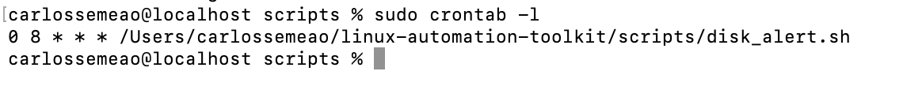
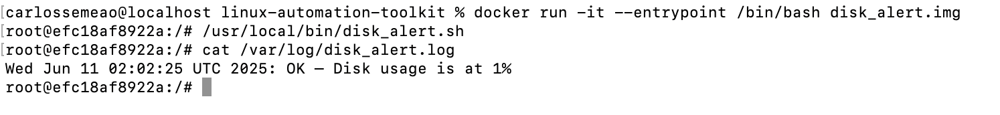
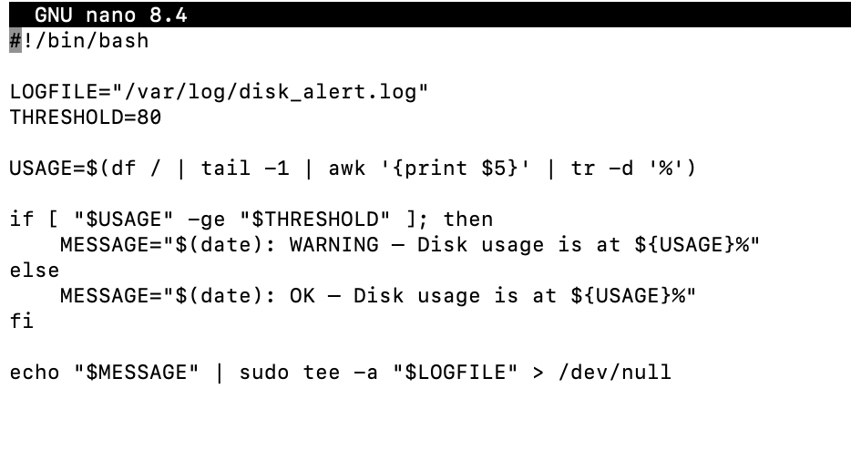
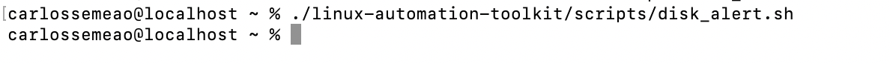
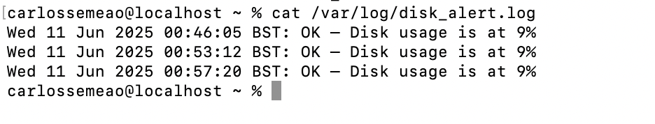

# 🛠️ Linux Automation Toolkit
_Bash scripting • Cron jobs • Git workflow • Docker containerization_  
Part of my **CompTIA Linux+ XK0-005** hands-on study path.

---

## 📌 Project Goal
Automate routine Linux administration tasks with a Bash script, schedule it via `cron`, and containerize it with Docker for portable execution.

| Feature | What it Proves |
|---------|----------------|
| **Bash script (`disk_alert.sh`)** | Command-line fluency, I/O redirection, conditions |
| **Cron job** | Recurring automation & log management |
| **Dockerfile** | Container basics & reproducible builds |
| **GitHub repo** | Version-controlled, well-documented portfolio artifact |

---

## 📂 Folder Structure
```
linux-automation-toolkit/
├── scripts/
│   └── disk_alert.sh          # disk usage monitoring script
├── cron/
│   └── daily-job.txt          # crontab entry (runs 08:00 daily)
├── docker/
│   ├── Dockerfile             # container build instructions
│   └── disk_alert.sh          # script copy used in the image
├── docs/
│   ├── bash-basics.md         # quick Bash recap
│   └── version-control-notes.md
├── screenshots/               # proof-of-work images
│   ├── 01-disk-alert-script-nano.png
│   ├── 02-disk-alert-script-execution.png
│   ├── 03-disk-alert-log-output.png
│   ├── 04-cron-disk-alert-entry.png
│   └── 05-docker-run-disk-alert.png
└── README.md
```

---

## 📜 `disk_alert.sh` (Bash Script)

Monitors `/` disk usage and appends a status line to `/var/log/disk_alert.log`.

```bash
#!/bin/bash
LOGFILE="/var/log/disk_alert.log"
THRESHOLD=80

USAGE=$(df / | tail -1 | awk '{print $5}' | tr -d '%')

if [ "$USAGE" -ge "$THRESHOLD" ]; then
    MESSAGE="$(date): WARNING – Disk usage is at ${USAGE}%"
else
    MESSAGE="$(date): OK – Disk usage is at ${USAGE}%"
fi

echo "$MESSAGE" >> "$LOGFILE"
```

*Key Bash concepts:* shebang, variables, command substitution, `awk`, comparison operators, redirection.

---

## 📅 Cron Job Automation

| Step | Command | Purpose |
|------|---------|---------|
| 1️⃣ | `sudo crontab -e` | Edit root crontab |
| 2️⃣ | Add line → `0 8 * * * /Users/carlossemeao/linux-automation-toolkit/scripts/disk_alert.sh` | Run script daily @ 08:00 |
| 3️⃣ | `sudo crontab -l` | Confirm job installed |

📸 Screenshot:  


Log sample:
```
Wed 11 Jun 2025 08:00:01 BST: OK – Disk usage is at 9%
```

---

## 🐳 Docker Container Execution

A minimal image runs the script in isolation.

**`docker/Dockerfile`**
```dockerfile
FROM debian:bullseye-slim
RUN apt-get update && apt-get install -y bash coreutils && rm -rf /var/lib/apt/lists/*
RUN mkdir -p /var/log
COPY disk_alert.sh /usr/local/bin/disk_alert.sh
RUN chmod +x /usr/local/bin/disk_alert.sh
CMD ["/usr/local/bin/disk_alert.sh"]
```

### 🔧 Build & Run
```bash
cd linux-automation-toolkit
docker build -t disk_alert.img ./docker
docker run --rm disk_alert.img
```

📸 Screenshot:  


---

## 📸 Development Screenshots

| # | Description | Image |
|---|-------------|-------|
| 1 | Script written in nano |  |
| 2 | Manual execution test |  |
| 3 | Log output on host |  |
| 4 | Cron job entry |  |
| 5 | Docker container output |  |

---

## 🧠 Lessons Learned
- **Bash**: variables, loops, conditions, logging  
- **Cron**: scheduling, redirection to log files  
- **Docker**: Dockerfile basics, custom entrypoint, container testing  
- **Git**: clean repo structure, meaningful commits, Markdown documentation

---

## 🚀 How to Extend
- Parameterize the script to monitor multiple mount points.  
- Add email or Slack notifications on warning.  
- Use Docker volumes to persist logs outside container.  
- Integrate this with Ansible for fleet-wide deployment.

---

## 📜 License
[MIT](LICENSE)
